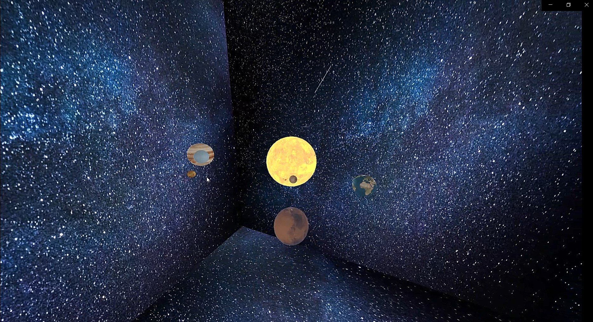

# Solar Sytem In Unity 3D:

A simple solar system simulation made by Unity3D.
- It is very simple Unity3D project of solar system simulation. by clicking on any  Planet the camera change it's focuse on that planet.

- There are 2 different cameras:
    1. Main Camera (Perspective camera) which shows the entire solar system.
    2. Minimap (Orthographic camera) which shows the top view of the solar system.

Screenshots
-----------

